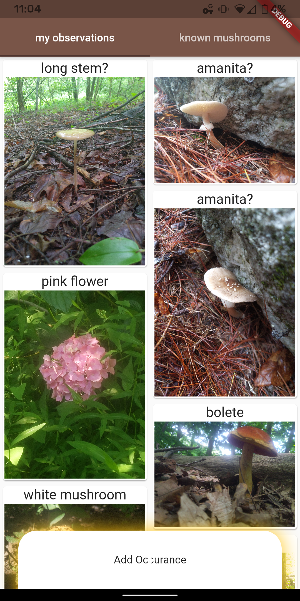
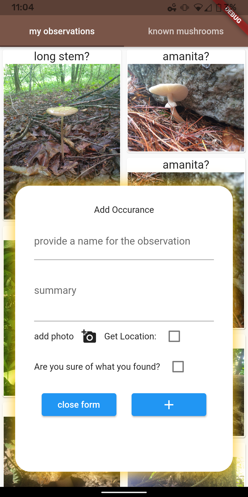

# Mushies!

A Flutter application for taking field notes with specific tools for mushrooms 

## Introduction

One purpose of technology is to make life easier. However, in practice, it often serves as a point of frustration. Ads, bad UI and the inability to easily perform cost/benefit analysis of data collection (how much am I really paying in giving my data away?) are three points of contention I find to be particularly irksome 

## Current Implementation

Mushies is still in its pre-alpha development phase. The app allows for taking notes alongside photo and gps storage capabilities. Currently, all storage is on device. This application is targeted to Android, however, Flutter allows for cross-platform functionality so don't hesitate to try and build it for whatever device you want

### Home Screen

The home screen shows two tabs 'my observations' and 'known mushrooms'. The 'my observations' tab shows a list of all the notes taken and the 'known mushrooms' tab shows a similar list, except the user has selected that the note is something they are sure of



### Adding an Observation

On the bottom of the home screen is a slider that can be tapped or swiped to bring up the 'add observation' widget. This widget can be dismissed without losing the information already typed and then brought up again. Gps information is stored upon adding the observation



## Steps to Alpha Release

- [x] Add observation
-  [ ] Drop a tag command
- [ ] take an audio-transcribed note
- [ ] Continuous voice recognition
- [ ] UI improvements including potentially dropping the 'known tab' for alpha
- [ ] Export data

## Tools Currently in Use

See [pubspec.yaml](pubspec.yaml) for the full list

 - Flutter/Dart: framework and language for writing the app
 - provider: state management
 - sliding-up-panel: the add-observation slider
 - hive: data persistence
 - geolocator: gps service

## Installing

Follow the [guide](https://flutter.dev/docs/get-started/install) for installing Flutter on your system. In order to run the Android version of this application, an Android device or simulator must be connected. 

Clone, and run the code with these commands:

```
git clone https://github.com/keggit/mushies.git
cd mushies
flutter run
```

If there is an android device connected, it will automatically run. Otherwise, select web or linux/windows/mac. 

The command `flutter doctor` is helpful for diagnosing issues with connected devices
